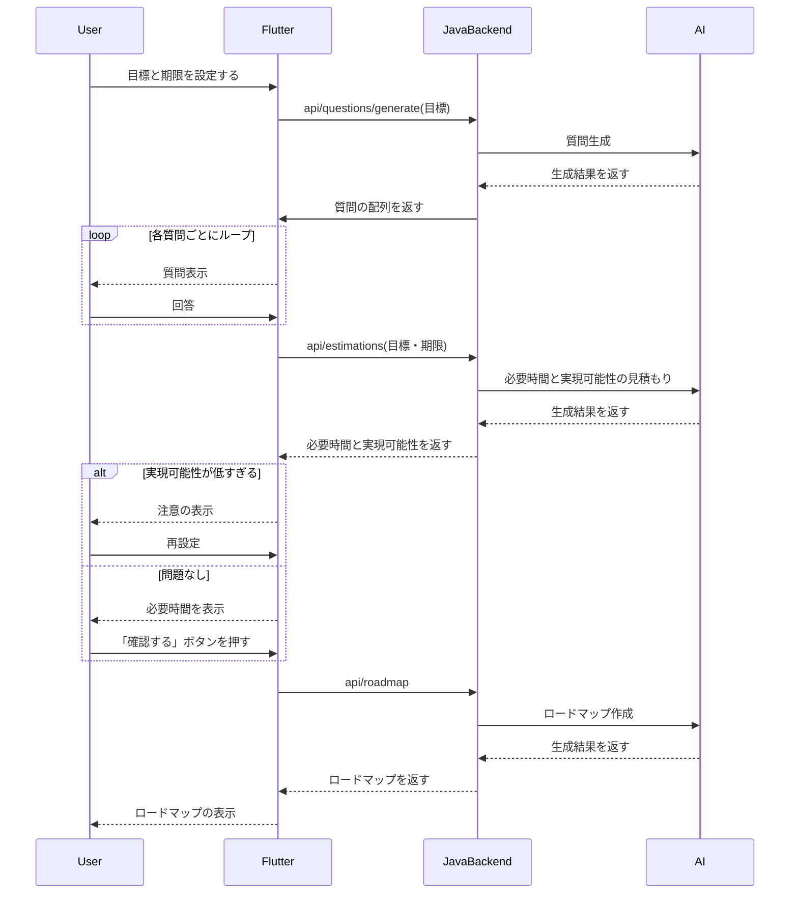

# 処理の流れ

## ロードマップ作成

```mermaid
sequenceDiagram
 participant User
 participant Flutter
 participant JavaBackend
 participant AI
 
 User ->> Flutter: 目標と期限を設定する
 Flutter ->> JavaBackend: api/questions/generate(目標)
 JavaBackend ->> AI: 質問生成
 AI -->> JavaBackend: 生成結果を返す
 JavaBackend ->> Flutter: 質問の配列を返す
 loop 各質問ごとにループ
 Flutter　-->> User: 質問表示
 User ->> Flutter: 回答
 end
 Flutter ->> JavaBackend: api/estimations(目標・期限)
 JavaBackend ->> AI: 必要時間と実現可能性の見積もり
 AI -->> JavaBackend: 生成結果を返す
 JavaBackend -->> Flutter: 必要時間と実現可能性を返す
alt 実現可能性が低すぎる
 Flutter -->> User: 注意の表示
 User ->> Flutter: 再設定
 else 問題なし
 Flutter -->> User: 必要時間を表示
 User ->> Flutter: 「確認する」ボタンを押す
 end
  Flutter ->> JavaBackend: api/roadmap
 JavaBackend ->> AI: ロードマップ作成
 AI -->> JavaBackend: 生成結果を返す
 JavaBackend　-->> Flutter: ロードマップを返す
 Flutter -->> User: ロードマップの表示
```
